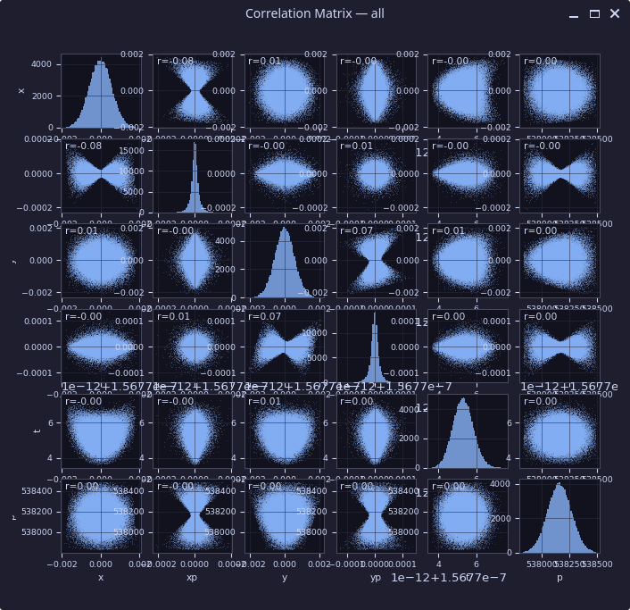
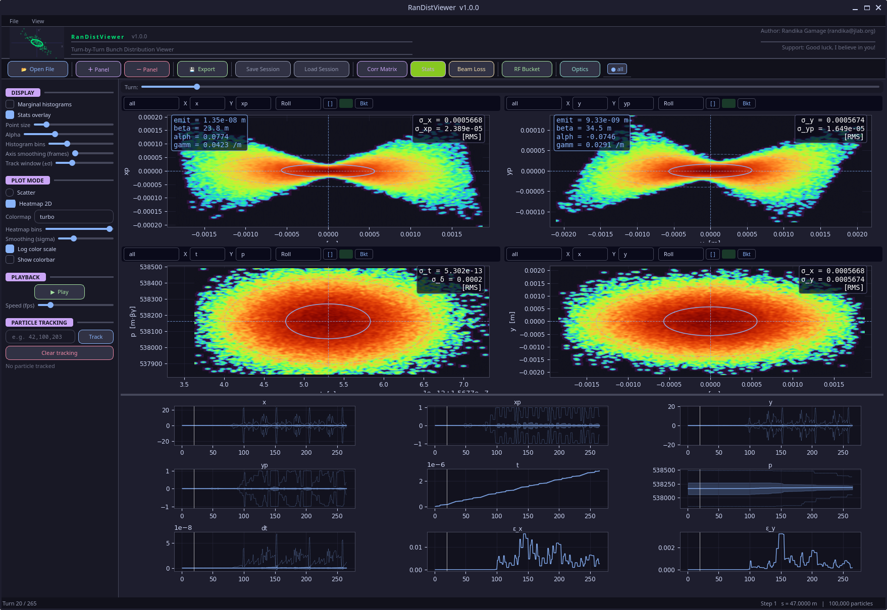
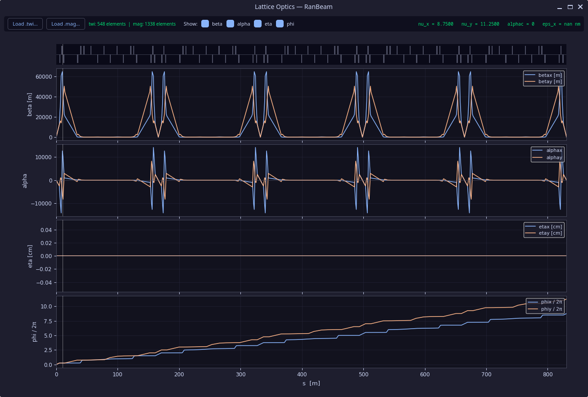

# Dialogs

---

## Correlation Matrix

Open via the **Corr Matrix** toolbar button.



Displays a full scatter-matrix (pair plot) of the particle coordinates
`x`, `xp`, `y`, `yp`, `t`, `p` for the current turn. Each off-diagonal cell
shows a 2D scatter of one coordinate pair with the Pearson correlation
coefficient *r* annotated. Diagonal cells show the 1D marginal distribution
for that coordinate.

The matrix updates when the turn changes while the dialog is open.

The title bar shows the current file label, e.g. `Correlation Matrix — all`.

---

## Stats Panel

Open via the **Stats** toolbar button.



Shows per-column beam statistics plotted as a function of turn number.
The panel is displayed as an additional row of subplots below the main panel
grid. Each subplot corresponds to one coordinate column:

`x`, `xp`, `y`, `yp`, `t`, `p`, `dt`, `ε_x`, `ε_y`

Statistics are pre-computed at file load time and cached, so the panel
renders instantly.

---

## RF Bucket Configuration

Open via the **RF Bucket** toolbar button.

Configures the RF separatrix overlay for the `(t, p)` phase-space panel.
The `Bkt` toggle on each panel header enables or disables the separatrix
for that panel individually.

!!! note "Axis mode requirement"
    The RF separatrix is only drawn correctly when the panel's axis mode
    includes offset subtraction. Use **Roll** or **Track** mode on the `(t, p)`
    panel — the reference `pCentral` and `tCentral` values from the SDDS page
    header are subtracted automatically.

### Parameters

| Field | Description |
|---|---|
| Particle species | Sets rest mass automatically (electron / proton) |
| Custom mass (MeV) | Override for other species |
| Momentum compaction αc | Lattice momentum compaction factor |
| Revolution frequency (MHz) | Design revolution frequency |
| Mode | `Static` or `Ramped` |

### Cavities (Static mode)

Each cavity requires:

| Field | Description |
|---|---|
| Voltage V (volts) | Peak cavity voltage |
| Harmonic h | RF harmonic number |
| Synchronous phase φs (deg) | Synchronous phase angle |

Click **+ Cavity** to add further cavities.

### Ramped RF (CSV mode)

Load a ramp schedule CSV with the column layout:

```
Time, V1, h1, phi_s1[, V2, h2, phi_s2, ...]
```

The viewer interpolates ramp parameters to the current turn's `tCentral` value
each frame.

---

## Optics Window

Open via the **Optics** toolbar button.



Displays ELEGANT Twiss functions in a standalone floating window titled
**Lattice Optics — RanBeam**.

!!! warning "Required files"
    The optics window only works if both a `.twi` (Twiss SDDS) file and a
    `.mag` (magnet description) file are present in your ELEGANT run directory.
    Load them with the **Load .twi…** and **Load .mag…** buttons in the window
    toolbar.

### Subplots

The window contains four stacked subplots against the longitudinal coordinate *s*:

| Row | Content |
|---|---|
| 1 | β functions — `betax` (blue) and `betay` (orange), in metres |
| 2 | α functions — `alphax` and `alphay` |
| 3 | Dispersion — `etax` and `etay`, in cm |
| 4 | Phase advance — `phix / 2π` and `phiy / 2π` |

The magnet strip above the plots shows element positions colour-coded by type.

### Toolbar info bar

The top bar shows loaded element counts and global lattice parameters:

```
twi: 548 elements  |  mag: 1338 elements    nu_x = 8.7500    nu_y = 11.2500    a1phac = 0    eps_x = nan nm
```

### Controls

| Button / Toggle | Action |
|---|---|
| **Load .twi…** | Open a Twiss SDDS file |
| **Load .mag…** | Open a magnet description file |
| **beta** | Toggle β function traces |
| **alpha** | Toggle α function traces |
| **eta** | Toggle dispersion traces |
| **phi** | Toggle phase advance traces |
