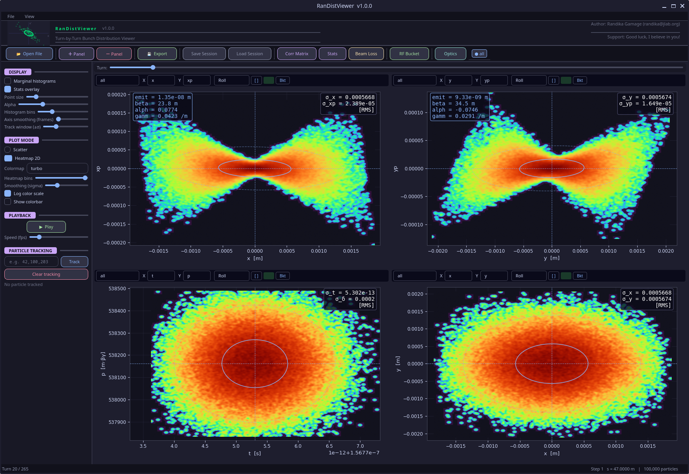

# GUI Overview



---

## Layout

```
┌──────────────────────────────────────────────────────────────────┐
│  Menu bar  (File · View)                                         │
├──────────────────────────────────────────────────────────────────┤
│  Header  [logo]  RanDistViewer v1.0.0   [author / support info]  │
├──────────────────────────────────────────────────────────────────┤
│  Toolbar  [Open File] [+Panel] [-Panel] [Export] [Save Session]  │
│           [Load Session] [Corr Matrix] [Stats] [Beam Loss]       │
│           [RF Bucket] [Optics] [all]                             │
├──────────────────────────────────────────────────────────────────┤
│  Turn slider  ──────────●─────────────────────────────────────── │
├────────────┬─────────────────────────────────────────────────────┤
│            │                                                     │
│  Sidebar   │  Panel grid                                         │
│  (left)    │  (one or more PlotPanel widgets)                    │
│            │                                                     │
├────────────┴─────────────────────────────────────────────────────┤
│  Status bar  Turn 20 / 265 · Step 1 s = 47.0000 m · 100,000 particles │
└──────────────────────────────────────────────────────────────────┘
```

---

## Menu bar

### File menu

| Item | Action |
|---|---|
| Open File | Load a binary SDDS bunch file |
| Save Session | Save full GUI state to JSON |
| Load Session | Restore a saved session |
| Export | Save all panels as interactive Plotly HTML |

### View menu

| Item | Action |
|---|---|
| + Panel | Add a new plot panel |
| − Panel | Remove the last plot panel |

---

## Toolbar

All major actions are accessible from the single toolbar row:

| Button | Action |
|---|---|
| **Open File** | Load a binary SDDS bunch file |
| **+ Panel** | Add a plot panel |
| **− Panel** | Remove a plot panel |
| **Export** | Export all panels as Plotly HTML |
| **Save Session** | Save GUI state to JSON |
| **Load Session** | Restore a saved session |
| **Corr Matrix** | Open the correlation scatter-matrix dialog |
| **Stats** | Show σ and emittance evolution plots over all turns |
| **Beam Loss** | Toggle beam-loss highlighting (lost particles in red) |
| **RF Bucket** | Configure and toggle the RF separatrix overlay |
| **Optics** | Open the Lattice Optics window (requires `.twi` and `.mag`) |
| **all** | Toggle display of all loaded files simultaneously |

---

## Turn slider

The turn slider below the toolbar scrubs to any turn in the loaded file.
The current turn and total number of turns are shown in the status bar
(`Turn 20 / 265`).

---

## Sidebar (left)

The left sidebar contains four collapsible sections with pill-shaped headers:

| Section | Contents |
|---|---|
| **DISPLAY** | Marginal histograms, Stats overlay, Point size, Alpha, Histogram bins, Axis smoothing frames, Track window (±σ) |
| **PLOT MODE** | Scatter / Heatmap 2D toggle, Colormap, Heatmap bins, Smoothing sigma, Log color scale, Show colorbar |
| **PLAYBACK** | Play/Pause button, Speed (fps) slider |
| **PARTICLE TRACKING** | Particle ID entry field, Track button, Clear tracking button |

See [Sidebar](sidebar.md) for full details.

---

## Panel grid

The panel grid holds one or more [PlotPanel](plot_panel.md) widgets arranged
in a 2×2 grid (default). Each panel has its own file selector, X/Y axis
selectors, axis-mode selector, and a `Bkt` toggle for the RF bucket overlay.

All panels share the current turn — advancing the slider updates all panels
simultaneously.

---

## Status bar

The status bar at the bottom shows the current turn number, total turns,
the current `s` position (element step), and the particle count:

```
Turn 20 / 265    Step 1  s = 47.0000 m    100,000 particles
```
